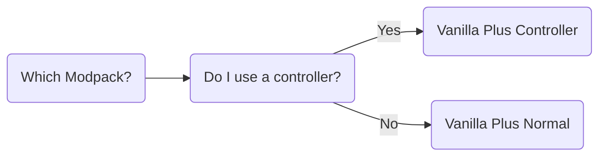

import Link from '/src/components/mdx/Link.astro';
import AlertBlockquote from '/src/components/mdx/AlertBlockquote.astro';
import Details from '/src/components/mdx/Details.astro';
import Tabs from '/src/components/mdx/Tabs.astro';
import TabItem from '/src/components/mdx/TabItem.astro';
import Gallery from '/src/components/mdx/Gallery.astro';
import { Carousel } from 'webcoreui/astro';
import { Accordion } from 'webcoreui/astro';

<AlertBlockquote type="info" title="Tip">
  Please, actually read the instructions in detail.
</AlertBlockquote>

# Server Information
A vanilla minecraft server for people who want a simpler experience. The modpacks below only add small QOL features and performance fixes. The server uses PurPur Minecraft as the backend.

# Installation
## Whitelist

My servers always include a whitelist, in order to join you must submit your account name and UUID to me:

1. Find account name and inpput into a [UUID](https://mcuuid.net/) finder
1. Add me as a Frend on Discord: Krieger#0144
1. Send me the account name and UUID
1. I will message when I have added you
1. At this time I will send you the login information for the fileshare (described below)

## Choosing a Modpack

## Prerequisites

1. Download and install the latest version of the [Prism Launcher](https://prismlauncher.org/)
1. Launch Prism and sign in to your Microsoft account
1. Download modpack one of the modpack options below. Both are nearly identicle except one has a mod that enables controller input.
	1. [Vanilla Plus Controller](https://fileshare.kriegerhost.xyz/public/share/skmbZ2_t4cc-Ujxq-sUQmw)
	1. [Vanilla Plus Normal](https://fileshare.kriegerhost.xyz/public/share/1Frpw3uOTZxKvcAJXtEMSg)
1. Inside Prism click the button in the top left corner that says **Add Instance**
1. In the list on the right of the pop-up window click **Import**
1. Click the **Browse** button and navigate to the location of whichever modpack you chose.
1. Click the instance to launch it, the server should be added already but in the event it is not the address is `mc.kriegerhost.xyz`

---
# Enjoy!
