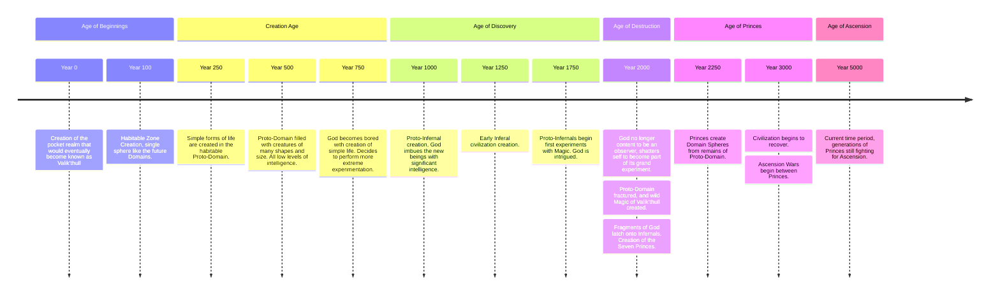

import Link from '/src/components/mdx/Link.astro';
import AlertBlockquote from '/src/components/mdx/AlertBlockquote.astro';
import Details from '/src/components/mdx/Details.astro';
import Tabs from '/src/components/mdx/Tabs.astro';
import TabItem from '/src/components/mdx/TabItem.astro';
import Gallery from '/src/components/mdx/Gallery.astro';
import { Carousel } from 'webcoreui/astro';
import { Accordion } from 'webcoreui/astro';
import { Timeline, TimelineItem } from 'webcoreui/astro';

## World

Valik’thull is an ethereal plane that exists alongside, and sometimes intertwined with, physical realms like Earth. Here, magic is not a force to be harnessed, but the very fabric of reality: fluid, raw, and fundamental.

Unlike orderly universes where magic has been distilled into matter, Valik’thull is a realm of unrefined potential. Its habitable regions are seven Domains: small, crafted bubbles of stability forged by generations of Princes from the surrounding chaos of raw magic.

These Domains are not natural formations. Each was shaped to resonate with one of the seven aspects of the shattered Creator: Space, Time, Soul, Fire, Water, Earth, and Air. Outside their borders lies the untamed void: a seething expanse of primordial magic where only the most powerful wielders can survive.

The Domains form a stable geometric structure in the chaos. The three strongest—Space, Time, and Soul—anchor the realm in a central tetrahedron. The four elemental Domains orbit them in a diamond pattern, each connected by teleportation arrays designed and maintained by the Princes of Space.

Each Domain is ruled by a Prince (not all are male), who inherits a throne once the previous Prince has died. For millennia, these seven have vied for the right of Ascension, to become God. None have succeeded.

Open war is rare, but the Domains are locked in endless political machinations and subtle power struggles. The three core Princes wield comparable might, while the four elemental rulers often squabble among themselves, shifting alliances like tides.

Royalty here carries no family name. Distinction comes from the magic in one’s blood and the strength of one’s House. A ruler is known simply as the Heir of their Domain until they ascend to power and choose a name worthy of legend.

And for half a century, no new heir has been born.

### Domains
The Seven Domains:
1. **[An Ciúnas Mór](/blog/valikthull/domain_of_space) (Domain of Space)**
2. **[Sioraíocht](/blog/valikthull/domain_of_time) (Domain of Time)**
3. **[Anam](/blog/valikthull/domain_of_soul) (Domain of Soul)**
4. **Talamh (Domain of Earth)**
5. **Aer (Domain of Air)**
6. **[Uisce](/blog/valikthull/domain_of_water) (Domain of Water)**
7. **[Aodh](/blog/valikthull/domain_of_fire) (Domain of Fire)**

## Infernals
The people of Valik’thull are not human. They are Infernals, beings crafted by a forgotten god to rule its pocket dimension. Though humanoid in form and anatomy, they are a race apart, shaped by magic and purpose.

Infernals stand on two legs, possess two arms, and share basic physiology with humanity, enough that interbreeding is possible. But their appearance marks them as otherworldly. Their skin tones defy earthly palettes: shades of white, grey, blue, deep red, and violet are common, each hue often tied to the elemental affinity of their home Domain.

Their most striking feature is their horns. These emerge from the sides or crown of the skull, curling like rams’, sweeping back like antelope, or standing straight and sharp like spears. Horn colour varies as widely as skin—sometimes matching, sometimes contrasting in vivid streaks of gold, obsidian, or pearl.

In Infernal society, horns are more than ornament. Size and complexity are seen as markers of power and potential. Larger, more elaborate horns command respect, and sometimes envy. They are instruments of both war and intimacy: to touch another’s horns is either a profound challenge or an act of deep trust, for the horns are intensely sensitive. Most consider them erogenous zones, and caressing them is reserved for lovers, family, or sworn rivals in ritual combat.

To grasp another’s horns without permission is a grave insult. To offer your own to be touched is a gesture of vulnerability few make lightly.

All Infernals possess an innate predisposition to manipulate Causality, what other realms might call magic. For them, it is not a mystical art but a fundamental force, as natural as breathing. Their abilities generally align with the Domain of their birth: Fire-born wield flame and heat; Water-born command currents and tides; those of the Soul Domain might influence emotion or memory.

They apply these gifts to every facet of life: battle, construction, fishing, agriculture, scientific inquiry, and art. Magic is not reserved for the elite, it is the foundation of their civilization.

But this power comes at a cost. Casting strains the body. Pushing beyond one’s limits drains vitality; attempting too much can lead to exhaustion, injury, or death. Magic is a muscle that can tear if overworked.

Only the Seven Princes transcend this limitation. Their power derives not from personal aptitude but from a source wholly different, and far greater than that of ordinary Infernals.

## Deep World Lore
<AlertBlockquote type="warning">
  Spoilers Ahead. Expand only if you don't want to figure out the story yourself in RP.
</AlertBlockquote>

### Creation

Long before the Princes, a powerful being created a pocket dimension to perform experiments. This being possessed control over all aspects of Causality. It formed a small world at the center of the void and populated it with creatures of all shapes and sizes, varying their cognitive capacities and playing with their lives to see what would happen.

After a while, the world grew stale. The being was no longer content to watch base creatures live out small lives driven by sustenance and procreation.

It decided to create something intelligent—something that could understand the world it had made. From this desire, the Infernals were born. They were the masterwork of centuries of experimentation, and they quickly became the dominant species on the burgeoning world. The god watched with fascination as its creations began to create in their own minuscule ways: forming societies, building structures, producing art, and eventually waging war.

The empty boredom of godhood filled with purpose. The being watched and nudged its creations along their path. Eventually, some Infernals began to experiment with Causality themselves. The god observed, fascinated, as they discovered small portions of its own power.

The Infernals advanced rapidly and began questioning their origins and the nature of their world. A concept formed in the god’s mind: it looked into the future and saw its creations growing until they destroyed themselves. No longer content to be an observer, it wanted to become part of its own experiment. But its power was too great to be contained within the creation in its entirety.

The god knew that fragmenting itself would most likely destroy the world it had built, but it also understood that true creation requires destruction. If its children were to forge their own destiny, they could not remain sheltered in a curated reality. They needed chaos, consequence, and the raw materials of a broken cosmos to rebuild something truly their own.

So the god turned its power inward, ripping and tearing at Causality, fracturing itself into seven pieces. The violence of the event shattered its small world, killing a significant portion of its creations. The void of the dimension filled with raw, swirling magic, a remnant of the cataclysmic power unleashed.

The seven fragments latched onto the strongest Infernals who survived the destruction of their world. Thus were born the Seven Princes of Valik’thull.

The Princes became vessels for pieces of their creator, each granted great power over one aspect of the god: Space, Time, Soul, Fire, Water, Earth, Air. Using their newfound abilities, they forged the Seven Domains from the remnants of their world and the raw magic swirling in the void.

### Ascension

The Princes became obsessed with determining the source of their power and the event that led to the destruction of their original world. They studied Causality, and each resolved to seek the answers of their creation by becoming God.

Due to their inherent nature, each Prince holds only an incomplete fragment. The only way to Ascend is to combine all seven pieces of the original Creator. Each generation of Princes fights, schemes, or studies—all attempting to decipher their origins, yet each drifts further from the true answer as generational knowledge is lost to time.

The Princes may produce offspring as any Infernal can, but an Heir does not become Prince until the previous one dies. Once a Prince dies, the fragment of God inhabits the strongest vessel it can find, typically the offspring of the late Prince. This fact is understood by the Princes, but the reason for it remains unknown. The prevailing theory is that each Domain can accept only one ruler, and that is where their power originates.

Over generations, the fragments have developed their own will. They are not fully sentient, but they possess a quasi-understanding of the world—like children wielding the power of a god. They whisper encouragement, shape perceptions, and reframe events to reinforce their host’s worldview, ensuring each Prince remains convinced that their isolated path is the one true route to power or ascension. In doing so, they keep the Princes from cooperating or from suspecting their shared origin. The pieces see Ascension as a type of death, and will fight against recombination as necessary.

### Timeline

*Year values are approximate in Earth years.*

